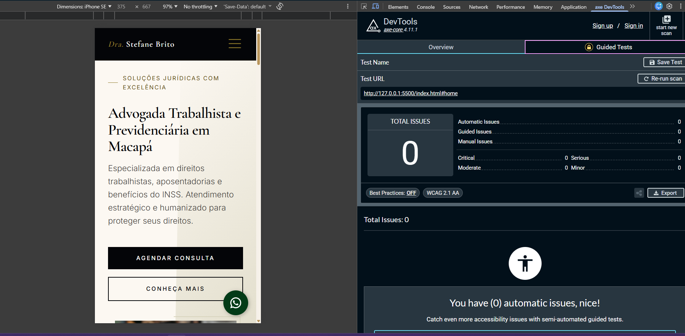

# ⚖️ Landing Page - Dra. Stefane Brito

   

Landing page institucional desenvolvida para apresentação profissional de serviços jurídicos, com foco em design moderno, responsividade e conversão de visitantes em contatos.
O projeto foi desenvolvido utilizando HTML, CSS e JavaScript, priorizando boas práticas de desenvolvimento front-end, performance e experiência do usuário.

## 📸 Preview

## 🚀 Funcionalidades

- 📱 Design Responsivo — adaptação completa para desktop, tablet e mobile
- ⚡ Alta Performance — carregamento rápido e otimização de recursos
- 🎯 Estrutura de Landing Page — layout focado em apresentação e conversão
- 📩 Call-to-Action (CTA) — botões estratégicos de contato via WhatsApp
- 🎨 Interface moderna — tipografia e cores voltadas ao segmento jurídico
- 📜 Seções organizadas
  - Apresentação
  - Serviços jurídicos
  - Sobre a profissional
  - Contato

## 🛠️ Tecnologias Utilizadas

- HTML5 Semântico
- CSS3 (Flexbox e Grid, Variáveis CSS, Layout Responsivo)
- JavaScript (Manipulação de DOM, eventos e interações de interface)

## 💡 Aprendizados

Durante o desenvolvimento deste projeto foram praticados:

- Estruturação semântica com HTML
- Layout responsivo (Mobile First)
- Tipografia e paleta de cores.
- Implementação de CTAs estratégicos
- Implementação de SEO (otimização para mecanismos de busca)
- Deploy e publicação de projetos

## 🚀 Performance

Resultados obtidos no Google Lighthouse:

- Performance: 97
- Accessibility: 100
- Best Practices: 100
- SEO: 100

## ♿ Acessibilidade

Este projeto foi validado utilizando o Axe DevTools, garantindo conformidade com boas práticas de acessibilidade.

### Resultado do teste automatizado

- ✅ 0 problemas críticos
- ✅ 0 problemas moderados
- ✅ Conformidade com WCAG 2.1 AA (testes automatizados)

> ⚠️ Testes manuais complementares são recomendados para garantir acessibilidade completa.

### Boas práticas aplicadas

- HTML semântico
- Estrutura com landmarks (header, main, nav, footer)
- Contraste de cores adequado
- Navegação por teclado
- Uso de atributos ARIA quando necessário

## 🔗 Link do Projeto

[Clique aqui para visitar](https://stefane-brito.vercel.app/)
